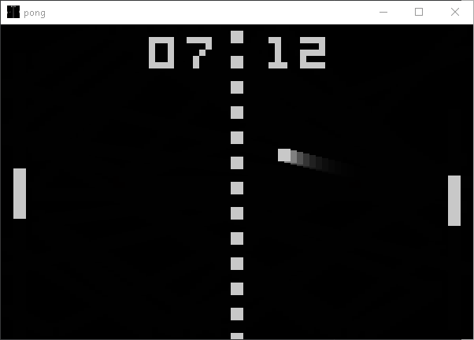

# Another PONG in SDL2

This amazing game was developped during my SDL2 studies.

I publish it in the hope the code would be benificial to anybody.
It concentrates most of the techniques I learnd so far.\
It's less 200 SLOC and plenty of comments.\

* The window is resisable, the contents will update automatically.
* The game will pause if its window is minimized
* I use transparency effects to simulate old CRT reminiscence.
* Uses SDL_Mixed for sounds

Two players only.\
One player uses Q and A, the other the up and down keys.\
The first to reach 15 wins and scores won't increment anymore.\
Press SPACE at any time to reset the scores and start a new game.

